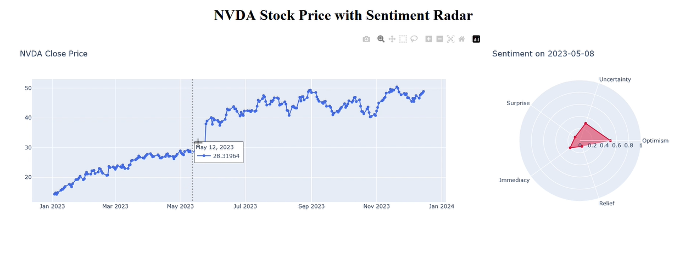

**Interactive Stock Sentiment Radar for NVDA**

This is a Dash-based web application that lets you explore daily sentiment metrics collected by an LLM alongside NVDA's closing price. Hovering over any point on the price chart reveals a radar plot visualizing multiple sentiment dimensions for that specific day.

  
<sup>Example of interactive price chart and sentiment radar</sup>

---

## Requirements

Install the following packages:

```
numpy
pandas
plotly
dash
xgboost
scikit-learn
jupyter
```

Modify the data collection script as you wish on the jupyter notebook (e.g. custom sentiments, more dates).

---

## Features

-  **Line chart** showing NVDA closing prices
-  **Radar chart** for sentiment metrics: Optimism, Uncertainty, Surprise, Immediacy, Relief
-  **Hover interactivity**: radar graph updates smoothly when hovering over price points
-  Designed for multi-metric analysis of news sentiment and price action
